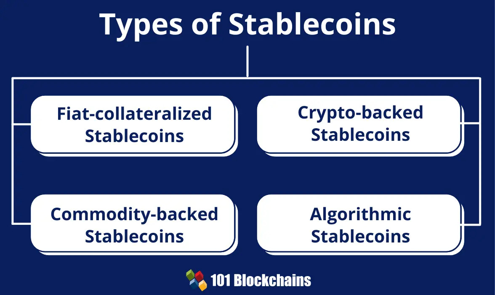

# DeFi 

## 介绍

> **DeFi 残酷共学**由 LXDAO Forge 小组发起，旨在通过“赛博社会主义”视角探索新世界的理财方法。

- **全面开放：**  我们的大门向所有人敞开，无需特定的技术背景或经验。
- **知识共享：**  我们鼓励知识交流，相信每个人都能为这个社区带来独特的视角。
- **实践融合：**  通过每日学习后提交在链上的交易 Hash，我们将理论与实践相结合，确保每个概念都能落地生根。
- **开源开放：** 以 GitHub 为学习平台，提供了一个开放、协作的学习环境。

**我们相信，DeFi 的大门对所有人敞开。在这里，你将找到志同道合的伙伴，一起学习、成长……**

## 关键词

DeFi, 稳定币, 借贷协议, DEX

## 面向人群

无论你是开发者，还是对 DeFi 充满好奇的普通人，我们都欢迎的加入。

## 报名时间

- 开始时间：2024-08-11
- 结束时间：2024-08-18

## 共学时间

- 开始时间：2024-08-19
- 结束时间：2024-09-08

## 发起人

- 姓名：Q
- GitHub ID：mon1y
- Telegram：@mon1y_q
- Email：mon1y1111@gmail.com

## 发起组织

- [LXDAO](https://lxdao.io/) 

## 请假规则

每周请假 2 次

## 社群

Telegram：https://t.me/LXDAO/11209

## 学习资料/课程安排


由于使用这些 DeFi 产品都是需要消耗真实的货币，且价格昂贵，所以我们找了一条 L2 来做测试，到时候大家进 TG 群发地址每人发一些 ETH 进行测试。
详细测试添加看[这里](https://www.notion.so/lxdao/a600e53cd02d455595a399f399dfbf72?pvs=25)。

> 「DeFi 残酷共学」预计将可持续的从第 1 期有序的推进到 N 期，21 天为一个学习周期，实现自主、开源开放，不断共同构建和完善 DeFi 共学资料及实践案例。
> 每周的线上会议，解答疑惑，分析事件，分享行业动态。

1. **稳定币机制**：了解不同类型的稳定币及其在 DeFi 中的作用。
2. **借贷协议**：探索 Aave、Compound 等借贷协议的工作原理。
3. **去中心化交易所（DEX）**：学习 Uniswap、SushiSwap 等 DEX 的交易机制。
4. **收益农场与流动性挖矿**：实践 Yield Farming 和 Liquidity Mining 策略。
5. **跨链技术**：研究 Stargate、Anyswap 等跨链桥和协议。
6. **预言机**：学习 Chainlink 等预言机在 DeFi 中的应用。
7. **去中心化衍生品**：分析 GMX、SNX 等衍生品平台。
8. **DeFi 安全**：讨论循环贷、闪电贷、治理攻击、Vetoken 等安全议题。

……

目前第 1 期共学内容：1-3「**稳定币机制**、**借贷协议**、**去中心化交易所（DEX）」**

#### 稳定币：如 USDT、DAI、算法稳定币

https://banklessdao.substack.com/p/the-stablecoin-edition-defi-download

https://nigdaemon.gitbook.io/how-to-defi-advanced-zhogn-wen-b/di-6-zhang-qu-zhong-xin-hua-de-wen-ding-bi-he-wen-ding-zi-chan

https://docs.makerdao.com/

https://web3caff.com/zh/archives/80903

https://www.binance.com/zh-CN/square/post/43195

USDT 官网：https://tether.to/

USDC 官网：https://www.circle.com/en/usdc

https://foresightnews.pro/article/detail/26988

https://mp.weixin.qq.com/s/gzr9q9kM3j-R0ec7sCb3NQ

相关使用网址：

https://staking.synthetix.io/staking/mint



#### 借贷协议：如 Aave、Compound

https://banklessdao.substack.com/p/the-lending-edition-defi-download

https://nigdaemon.gitbook.io/how-to-defi-advanced-zhogn-wen-b/di-5-zhang-qu-zhong-xin-hua-de-jie-dai

https://docs.aave.com/hub

https://docs.compound.finance/

相关使用链接：

https://app.aave.com/?marketName=proto_optimism_v3

https://app.compound.finance/?market=usdc-op

#### 去中心化交易所（DEX）：如 Uniswap、SushiSwap 以及 DEX 聚合器

https://banklessdao.substack.com/p/the-amm-edition-part-i-defi-download

https://banklessdao.substack.com/p/the-amm-edition-part-ii-defi-download

https://nigdaemon.gitbook.io/how-to-defi-advanced-zhogn-wen-b/di-3-zhang-qu-zhong-xin-hua-jiao-yi-suo

https://nigdaemon.gitbook.io/how-to-defi-advanced-zhogn-wen-b/di-4-zhang-dex-ju-he-qi

https://docs.uniswap.org/

https://docs.curve.fi/documentation-overview/

相关使用链接：

https://velodrome.finance/

https://app.uniswap.org/swap

## 共学激励

**🏅NFT 徽章：** 完成 DeFi 共学的小伙伴结业将收到一枚 Badge 徽章认证。

**🎁 特别奖励：** 我们相信，真正的学习是教会你如何获取所需，随着你的技能提升，一系列特别奖励将随之而来。

## 更多信息

**📘 共学目标：**

- 深入理解 DeFi 的基本原理和应用。
- 探索区块链技术在金融领域的创新。
- 掌握 DeFi 工具和平台的使用方法。
- 分析和评估 DeFi 项目的风险与机会。

## 报名和打卡规则

- 报名规则：请在报名截止时间前进行报名，共学一旦开始后，不得中途加入
- 打卡规则：建议你每天学习 30 ～ 60 分钟，并将学习笔记提交，我们会自动更新你的打卡状态，每周有两次请假的机会，超过后状态变为 ❌，视为本次共学失败

因为残酷共学的报名和打卡是基于 GitHub 进行开展的，如果你是非开发者或者对 git 操作不熟悉，请先阅读此文档：[残酷共学 GitHub 新手教程](https://www.notion.so/lxdao/GitHub-53fca5ba49bb40c69e4e40e69f58f416)

- 报名:

  - Step01：Fork 本仓库。
  - Step02：复制 Template.md 创建你的个人笔记文件，并根据文档指引填写你的信息，并将文件重命名为你的名字：YourName.md。
  - Step03：创建一个 PR 到当前仓库，本残酷共学助教会对你的 PR 进行 review，review 通过后，你的 PR 会被 merge 到 main 分支，这个时候你会收到邀请加入这个仓库 contribution 的邮件，接受邀请后，你会自动获得 main 分支的 push 权限。
  - Step04：完成以上三个步骤，恭喜你报名成功，后续就可以将你的学习记录直接 push 到 main 分支进行更新。
  - 请加入 tg 群组保持交流：http://t.me/LXDAO。加入群组后请在群里报到一下方便助教记录。

- 打卡：
  - 报名成功后，你将拥有 main 分支的 push 权限，你需要将每天学习笔记按日期更新到你的 YourName.md 文档中，提交更新后，我们会自动更新你的打卡状态到下面的打卡记录表。
  - 如果你不在 UTC+8 时区，需要添加时区 code 到你的 YourName.md 文件的开始，错误的时区设置可能会使自动化打卡脚本错误计算打卡时间，具体请参考：https://github.com/IntensiveCoLearning/template/blob/main/Template.md?plain=1#L1
  - 当你提交笔记时，请确保以下几点，否则打卡可能会失败：
    - 在 YourName.md 文档，请将笔记内容放到以下代码块中，且 `<!-- Content_START -->` 和 `<!-- Content_END -->` 不能删除:
    ```
    <!-- Content_START -->
    ### 日期
    笔记内容
    <!-- Content_END -->
    ```
    - 日期格式为 `### 2024.07.11`，请不要随意更改

## 残酷共学打卡记录表

✅ = Done ⭕️ = Missed ❌ = Failed

<!-- START_COMMIT_TABLE -->
| Name | 8.19 | 8.20 | 8.21 | 8.22 | 8.23 | 8.24 | 8.25 | 8.26 | 8.27 | 8.28 | 8.29 | 8.30 | 8.31 | 9.01 | 9.02 | 9.03 | 9.04 | 9.05 | 9.06 | 9.07 | 9.08 |
| ------------- | ---- | ---- | ---- | ---- | ---- | ---- | ---- | ---- | ---- | ---- | ---- | ---- | ---- | ---- | ---- | ---- | ---- | ---- | ---- | ---- | ---- |
| [Joan1caster](Joan1caster.md) | ⭕️ | ✅ | ✅ | ✅ | ✅ | ⭕️ | ✅ | ✅ | ✅ | ✅ | ⭕️ | ✅ | ✅ | ⭕️ | ✅ | ✅ | ⭕️ | ✅ | ✅ | ✅ | ✅ |
| [leokkk88](leokkk88.md) | ⭕️ | ⭕️ | ❌ | | | | | | | | | | | | | | | | | | |
| [markerup](markerup.md) | ⭕️ | ⭕️ | ❌ | | | | | | | | | | | | | | | | | | |
| [nocb](nocb.md) | ✅ | ✅ | ✅ | ✅ | ✅ | ✅ | ⭕️ | ✅ | ✅ | ✅ | ✅ | ✅ | ⭕️ | ⭕️ | ✅ | ✅ | ✅ | ✅ | ⭕️ | ✅ | ✅ |
| [Defi残酷共学-Mark](Defi残酷共学-Mark.md) | ⭕️ | ⭕️ | ❌ | | | | | | | | | | | | | | | | | | |
| [charlottyge](charlottyge.md) | ⭕️ | ⭕️ | ❌ | | | | | | | | | | | | | | | | | | |
| [wureny](wureny.md) | ✅ | ✅ | ⭕️ | ✅ | ⭕️ | ❌ | | | | | | | | | | | | | | | |
| [joyc](joyc.md) | ⭕️ | ✅ | ⭕️ | ✅ | ✅ | ✅ | ✅ | ✅ | ✅ | ✅ | ⭕️ | ⭕️ | ✅ | ✅ | ✅ | ✅ | ⭕️ | ⭕️ | ✅ | ✅ | ✅ |
| [btou666](btou666.md) | ✅ | ✅ | ✅ | ✅ | ✅ | ✅ | ✅ | ⭕️ | ✅ | ✅ | ✅ | ⭕️ | ✅ | ✅ | ⭕️ | ⭕️ | ❌ | | | | |
| [mmssddss](mmssddss.md) | ✅ | ✅ | ✅ | ✅ | ✅ | ✅ | ✅ | ✅ | ✅ | ✅ | ✅ | ✅ | ✅ | ✅ | ✅ | ✅ | ✅ | ✅ | ✅ | ✅ | ✅ |
| [wayhome](wayhome.md) | ✅ | ✅ | ✅ | ✅ | ✅ | ✅ | ✅ | ✅ | ✅ | ✅ | ✅ | ✅ | ✅ | ✅ | ✅ | ✅ | ✅ | ✅ | ✅ | ✅ | ⭕️ |
| [wzl521](wzl521.md) | ✅ | ✅ | ✅ | ✅ | ✅ | ✅ | ✅ | ✅ | ✅ | ✅ | ✅ | ✅ | ✅ | ✅ | ✅ | ✅ | ✅ | ✅ | ✅ | ✅ | ✅ |
| [Chen-XueLing](Chen-XueLing.md) | ⭕️ | ⭕️ | ❌ | | | | | | | | | | | | | | | | | | |
| [rayjun](rayjun.md) | ✅ | ✅ | ✅ | ✅ | ✅ | ✅ | ✅ | ✅ | ✅ | ✅ | ✅ | ✅ | ✅ | ⭕️ | ✅ | ⭕️ | ✅ | ⭕️ | ❌ | | |
| [HeliosLz](HeliosLz.md) | ⭕️ | ⭕️ | ✅ | ✅ | ✅ | ❌ | | | | | | | | | | | | | | | |
| [Ellenp2p](Ellenp2p.md) | ⭕️ | ⭕️ | ❌ | | | | | | | | | | | | | | | | | | |
| [weifengHuang](weifengHuang.md) | ⭕️ | ✅ | ✅ | ✅ | ⭕️ | ✅ | ✅ | ✅ | ✅ | ⭕️ | ⭕️ | ✅ | ✅ | ✅ | ✅ | ✅ | ✅ | ⭕️ | ⭕️ | ✅ | ✅ |
| [punkcanyang](punkcanyang.md) | ✅ | ✅ | ✅ | ✅ | ✅ | ✅ | ✅ | ✅ | ✅ | ✅ | ⭕️ | ⭕️ | ❌ | | | | | | | | |
| [LunaWang5209](LunaWang5209.md) | ✅ | ✅ | ✅ | ✅ | ✅ | ✅ | ✅ | ✅ | ⭕️ | ✅ | ✅ | ✅ | ⭕️ | ✅ | ✅ | ⭕️ | ✅ | ✅ | ✅ | ✅ | ✅ |
| [wodeche](wodeche.md) | ⭕️ | ⭕️ | ❌ | | | | | | | | | | | | | | | | | | |
| [Harriswww](Harriswww.md) | ✅ | ⭕️ | ⭕️ | ❌ | | | | | | | | | | | | | | | | | |
| [zedz](zedz.md) | ✅ | ✅ | ✅ | ✅ | ✅ | ✅ | ✅ | ✅ | ⭕️ | ⭕️ | ❌ | | | | | | | | | | |
| [mon1y](mon1y.md) | ✅ | ⭕️ | ✅ | ✅ | ✅ | ✅ | ✅ | ⭕️ | ✅ | ✅ | ✅ | ✅ | ✅ | ✅ | ⭕️ | ✅ | ✅ | ✅ | ✅ | ✅ | ✅ |
| [Young-Jeff](Young-Jeff.md) | ⭕️ | ⭕️ | ❌ | | | | | | | | | | | | | | | | | | |
| [Coooder-Crypto](Coooder-Crypto.md) | ⭕️ | ⭕️ | ✅ | ✅ | ✅ | ✅ | ✅ | ✅ | ⭕️ | ⭕️ | ❌ | | | | | | | | | | |
| [boombb12138](boombb12138.md) | ✅ | ✅ | ✅ | ✅ | ✅ | ✅ | ✅ | ✅ | ⭕️ | ✅ | ✅ | ✅ | ✅ | ⭕️ | ✅ | ✅ | ✅ | ✅ | ✅ | ✅ | ✅ |
| [dethan3](dethan3.md) | ⭕️ | ⭕️ | ❌ | | | | | | | | | | | | | | | | | | |
| [Glances](Glances.md) | ✅ | ✅ | ✅ | ✅ | ✅ | ⭕️ | ⭕️ | ⭕️ | ⭕️ | ❌ | | | | | | | | | | | |
| [qiaopengjun5162](qiaopengjun5162.md) | ✅ | ✅ | ✅ | ✅ | ✅ | ✅ | ✅ | ✅ | ✅ | ✅ | ✅ | ✅ | ✅ | ✅ | ✅ | ✅ | ✅ | ✅ | ✅ | ✅ | ✅ |
| [notthere-2023](notthere-2023.md) | ⭕️ | ⭕️ | ❌ | | | | | | | | | | | | | | | | | | |
| [xiaodongQ](xiaodongQ.md) | ⭕️ | ⭕️ | ❌ | | | | | | | | | | | | | | | | | | |
| [luffythink](luffythink.md) | ✅ | ✅ | ✅ | ⭕️ | ✅ | ✅ | ⭕️ | ✅ | ✅ | ✅ | ✅ | ✅ | ⭕️ | ⭕️ | ✅ | ✅ | ✅ | ✅ | ✅ | ✅ | ✅ |
| [Huowuge](Huowuge.md) | ⭕️ | ✅ | ✅ | ✅ | ✅ | ✅ | ✅ | ✅ | ✅ | ✅ | ⭕️ | ✅ | ✅ | ⭕️ | ✅ | ✅ | ✅ | ⭕️ | ✅ | ⭕️ | ✅ |
| [LRlulu](LRlulu.md) | ⭕️ | ✅ | ⭕️ | ✅ | ✅ | ✅ | ✅ | ✅ | ⭕️ | ⭕️ | ✅ | ✅ | ❌ | | | | | | | | |
| [WENDY1233211991](WENDY1233211991.md) | ✅ | ✅ | ✅ | ✅ | ⭕️ | ✅ | ⭕️ | ⭕️ | ✅ | ✅ | ⭕️ | ❌ | | | | | | | | | |
| [imaffe](imaffe.md) | ✅ | ✅ | ⭕️ | ⭕️ | ❌ | | | | | | | | | | | | | | | | |
| [Iyi](Iyi.md) | ✅ | ✅ | ✅ | ✅ | ✅ | ✅ | ⭕️ | ✅ | ✅ | ✅ | ✅ | ⭕️ | ✅ | ✅ | ⭕️ | ⭕️ | ❌ | | | | |
| [Sifotd](Sifotd.md) | ✅ | ✅ | ⭕️ | ✅ | ⭕️ | ✅ | ✅ | ⭕️ | ✅ | ✅ | ⭕️ | ❌ | | | | | | | | | |
| [linghuccc](linghuccc.md) | ✅ | ⭕️ | ⭕️ | ✅ | ✅ | ✅ | ✅ | ✅ | ⭕️ | ✅ | ⭕️ | ✅ | ✅ | ✅ | ✅ | ✅ | ✅ | ⭕️ | ✅ | ✅ | ⭕️ |
| [TheHeBoy](TheHeBoy.md) | ✅ | ⭕️ | ⭕️ | ❌ | | | | | | | | | | | | | | | | | |
| [DerickIT](DerickIT.md) | ✅ | ✅ | ✅ | ✅ | ✅ | ✅ | ⭕️ | ✅ | ✅ | ✅ | ✅ | ✅ | ✅ | ✅ | ✅ | ⭕️ | ✅ | ✅ | ✅ | ✅ | ✅ |
| [snaildarter](snaildarter.md) | ✅ | ✅ | ✅ | ✅ | ✅ | ✅ | ✅ | ✅ | ✅ | ✅ | ✅ | ✅ | ✅ | ✅ | ✅ | ✅ | ✅ | ✅ | ✅ | ✅ | ✅ |
| [yuxing11](yuxing11.md) | ⭕️ | ⭕️ | ❌ | | | | | | | | | | | | | | | | | | |
| [404ll](404ll.md) | ⭕️ | ⭕️ | ❌ | | | | | | | | | | | | | | | | | | |
| [gillsgills](gillsgills.md) | ✅ | ✅ | ✅ | ✅ | ✅ | ⭕️ | ⭕️ | ✅ | ✅ | ✅ | ✅ | ⭕️ | ✅ | ⭕️ | ✅ | ✅ | ✅ | ✅ | ⭕️ | ✅ | ⭕️ |
| [muxin-web3](muxin-web3.md) | ✅ | ✅ | ✅ | ⭕️ | ✅ | ⭕️ | ✅ | ✅ | ✅ | ⭕️ | ⭕️ | ✅ | ❌ | | | | | | | | |
| [L1rul1n](L1rul1n.md) | ✅ | ✅ | ⭕️ | ✅ | ⭕️ | ❌ | | | | | | | | | | | | | | | |
| [Tunnelai](Tunnelai.md) | ✅ | ✅ | ✅ | ✅ | ✅ | ✅ | ✅ | ✅ | ✅ | ✅ | ⭕️ | ⭕️ | ❌ | | | | | | | | |
| [YuKirasawa](YuKirasawa.md) | ⭕️ | ✅ | ✅ | ✅ | ✅ | ✅ | ⭕️ | ⭕️ | ⭕️ | ❌ | | | | | | | | | | | |
| [novac42code](novac42code.md) | ✅ | ✅ | ✅ | ✅ | ✅ | ⭕️ | ⭕️ | ✅ | ✅ | ✅ | ⭕️ | ✅ | ✅ | ⭕️ | ✅ | ✅ | ⭕️ | ✅ | ⭕️ | ✅ | ✅ |
| [alex lee](alex lee.md) | ⭕️ | ⭕️ | ❌ | | | | | | | | | | | | | | | | | | |
<!-- END_COMMIT_TABLE -->


<!-- STATISTICALDATA_START -->


## 统计数据

- 总参与人数: 51
- 完成人数: 18
- 完成用户: Joan1caster, nocb, joyc, mmssddss, wayhome, wzl521, weifengHuang, LunaWang5209, mon1y, boombb12138, qiaopengjun5162, luffythink, Huowuge, linghuccc, DerickIT, snaildarter, gillsgills, novac42code
- 全勤用户: mmssddss, wzl521, qiaopengjun5162, snaildarter
- 淘汰人数: 33
- 淘汰率: 64.71%
- Fork人数: 80
<!-- STATISTICALDATA_END -->
